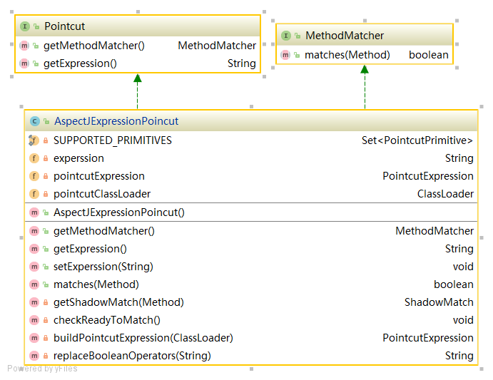

# 开头

pointcut 提供了对表达式和方法进行匹配的方法，主要依赖于 aspectj 去实现。其核心是通过表达式创建 PointcutExpression 类来匹配方法名。

```java
    /**
     * 对方法和表达式进行匹配
     * @param method 匹配的方法
     * @return 是否匹配上
     */
    @Override
    public boolean matches(Method method) {
        // 懒加载的模式来加载 pointcutExpression
        checkReadyToMatch();
        // 获取匹配后的实体
        ShadowMatch shadowMatch = getShadowMatch(method);

        if (shadowMatch.alwaysMatches()){
            return true;
        }
        return false;
    }
```
AspectJExpressionPoincut类图：



