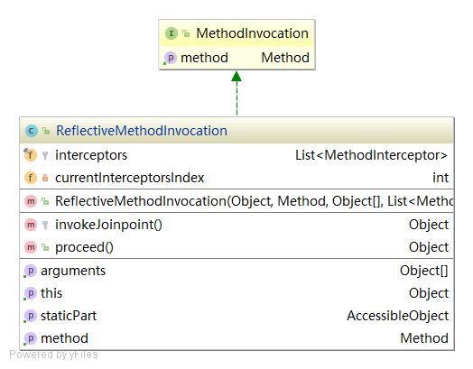
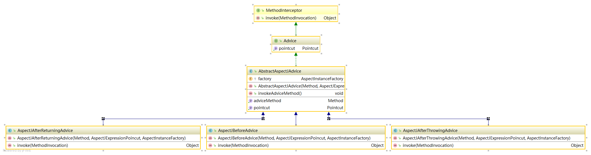

# ReflectiveMethodInvocation

ReflectiveMethodInvocation 是目标方法的代理类，再目标方法执行前循环执行一遍加入的MethodInterceptor。

核心方法，通过递归的方式将MethodInterceptors执行完
```java
    /**
     * 循环执行MethodInterceptor
     * @return
     * @throws Throwable
     */
    @Override
    public Object proceed() throws Throwable {
        if (this.currentInterceptorsIndex == this.interceptors.size() - 1){
            return invokeJoinpoint();
        }
        this.currentInterceptorsIndex ++;
        MethodInterceptor methodInterceptor = this.interceptors.get(this.currentInterceptorsIndex);

        return methodInterceptor.invoke(this);

    }
```
MethodInterceptors invoke的实现示例：AspectJAfterReturningAdvice
 ```java
public Object invoke(MethodInvocation methodInvocation) throws Throwable{
        Object o = methodInvocation.proceed();
        this.invokeAdviceMethod();
        return o;
    }
```



