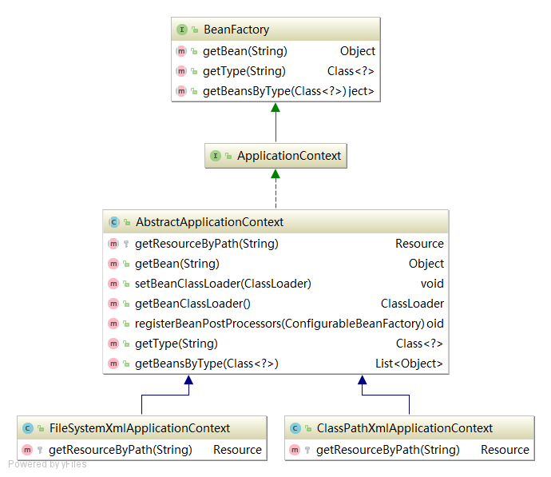

# 开头

ApplicationContext 作为容器对外提供获取bean的接口。其抽象类 AbstractApplicationContext 内置了 DefaultBeanFactory，XmlBeanDefinitionReader，Resource 分别进行Bean存储，Bean加载以及配置文件的加载。  
构造方法：
 ```java
public AbstractApplicationContext(String configFile) {
        // 存放 bean 定义的工厂
        factory = new DefaultBeanFactory();
        // 对配置文件进行解析和加载factory的类
        XmlBeanDefinitionReader reader = new XmlBeanDefinitionReader(factory);
        // 获取配置文件的抽象输入
        Resource resource = this.getResourceByPath(configFile);
        // 通过 Resource 提供的 IO 流对配置文件进行解析
        reader.loadBeanDefinitions(resource);
        factory.setBeanClassLoader(this.getBeanClassLoader());
        registerBeanPostProcessors(factory);
    }
```
ApplicationContext 类图：  


其中ClassPathXmlApplicationContext和FileSystemXmlApplicationContext分别代表两种配置文件的加载方式，通过重写getResourceByPath方法实现（策略模式）。